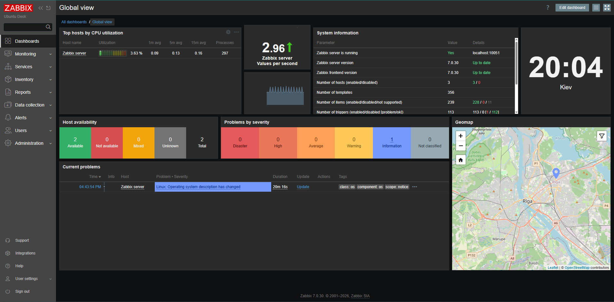
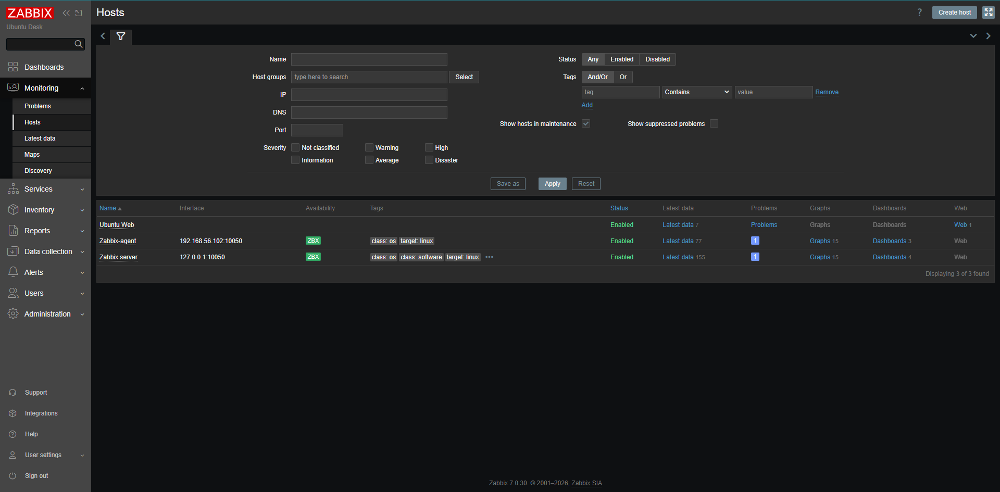
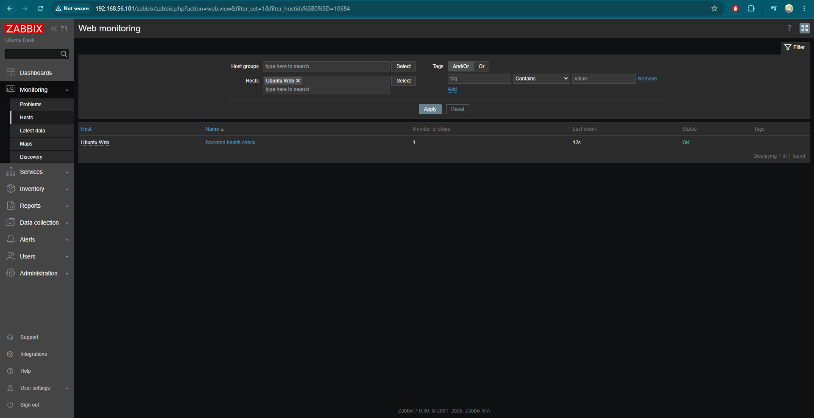
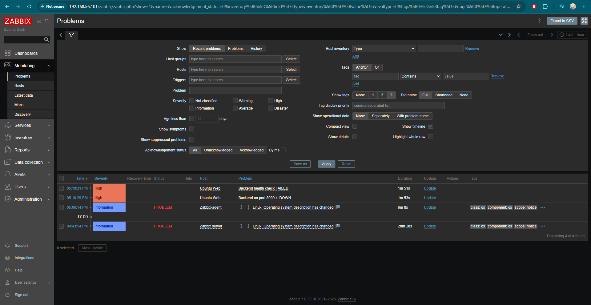

# Linux Infrastructure & Monitoring Home Lab

A small Linux infrastructure home lab built to practice system administration, monitoring, containerization, networking, and troubleshooting.

The project includes a Zabbix monitoring server, a separate monitored Ubuntu host, and a containerized web service running with Docker Compose and Nginx.

The main goal of this lab is to simulate basic tasks performed by a Junior NOC Engineer, System Administrator, or DevOps Engineer.

---

## Architecture

                       Host Machine
                          Windows
                             |
                   VirtualBox Host-Only
                      192.168.56.0/24
                             |
             +---------------+---------------+
             |                               |
             v                               v

      Ubuntu Monitoring VM             Ubuntu Agent VM
       192.168.56.101                  192.168.56.102
             |                               |
             |                               |
     +-----------------+             +----------------+
     | Zabbix Server   |             | Zabbix Agent 2 |
     | MySQL           |             | Linux metrics  |
     | Apache / PHP    |             +----------------+
     | Zabbix Agent 2  |
     +-----------------+
             |
             |
        Docker Compose
             |
       +-----+------+
       |            |
     Nginx       Backend
                  :8000


Both virtual machines also use a NAT interface for Internet access.

---

## Technologies

### Operating Systems

* Ubuntu Linux
* Windows host system

### Monitoring

* Zabbix 7.0 LTS
* Zabbix Agent 2
* Zabbix Web Scenarios
* Templates
* Items
* Triggers
* Problems and recovery events

### Containers and Web

* Docker
* Docker Compose
* Nginx
* HTTP

### Database

* MySQL

### Networking

* TCP/IP
* NAT
* VirtualBox Host-Only Networking
* Static IP addressing
* HTTP
* DNS basics

### Troubleshooting Tools

* `ping`
* `curl`
* `ss`
* `dig`
* `nslookup`
* `systemctl`
* `journalctl`
* `top`
* `ps`
* `df`
* `du`
* `docker compose ps`
* `docker compose logs`
* `docker stats`

---

## What I Implemented

### Zabbix Server

Deployed a Zabbix 7.0 LTS monitoring server on Ubuntu.

The monitoring server uses:

* MySQL for storing configuration and monitoring data
* Apache and PHP for the Zabbix web interface
* Zabbix Server for collecting and processing metrics

---

### Linux Host Monitoring

Configured a second Ubuntu virtual machine with Zabbix Agent 2.

The host is monitored using the standard Linux Zabbix template.

Collected metrics include:

* CPU utilization
* Memory utilization
* Disk usage
* Filesystem information
* Network traffic
* System load
* System uptime
* Running processes

---

## Network Configuration

The lab uses two network interfaces on each virtual machine.

### NAT

Used for Internet access and package installation.

### Host-Only Network

Used for communication between the Zabbix Server, monitored host, and host machine.

Example lab addresses:

| Host                    | IP Address       |
| ----------------------- | ---------------- |
| Zabbix Server           | `192.168.56.101` |
| Zabbix Agent            | `192.168.56.102` |
| VirtualBox Host Adapter | `192.168.56.1`   |

This allows the monitoring network to remain isolated from the external network while both virtual machines still have Internet access through NAT.

---

## Dockerized Web Service

A small web service is deployed using Docker Compose.

Example:

```bash
docker compose up -d
```

Container status can be checked using:

```bash
docker compose ps
```

Logs:

```bash
docker compose logs
```

The backend is available on:

```text
http://localhost:8000
```

Example health response:

```json
{
  "status": "ok",
  "message": "Ubuntu Web Environment backend is working"
}
```

---

## HTTP Monitoring

Zabbix Web Monitoring is used to verify that the application is actually working.

Instead of checking only whether TCP port `8000` is open, the Web Scenario performs an HTTP request and validates the application response.

The health check verifies:

* HTTP connection is successful
* HTTP response code is `200`
* Response contains:

```text
"status": "ok"
```

Example Web Scenario:

```text
Name: Backend health check

URL:
http://127.0.0.1:8000/

Required status code:
200

Required string:
"status"\s*:\s*"ok"
```

This makes it possible to detect an application failure even when the web server itself is still running.

---

## Monitoring Flow

```text
Application
    |
    v
HTTP request
    |
    v
Zabbix Web Scenario
    |
    +---- HTTP 200?
    |
    +---- status = "ok"?
    |
    v
Healthy / Failed
    |
    v
Trigger
    |
    v
PROBLEM
```

When the application becomes available again, Zabbix automatically changes the event state to:

```text
RESOLVED
```

---

## Failure Simulation

One of the goals of the lab was to test monitoring during real service failures.

The application can be stopped using:

```bash
docker compose down
```

The HTTP check then fails and Zabbix generates a problem.

After starting the service again:

```bash
docker compose up -d
```

Zabbix detects that the service is healthy again and automatically resolves the problem.

This simulates a simple NOC incident lifecycle:

```text
Service failure
      |
      v
Monitoring detects problem
      |
      v
Alert / Problem
      |
      v
Troubleshooting
      |
      v
Service recovery
      |
      v
RESOLVED
```

---

## Troubleshooting Practice

The lab was also used to practice systematic troubleshooting.

### Check host connectivity

```bash
ping 192.168.56.102
```

### Check listening ports

```bash
ss -lntp
```

Example:

```bash
ss -lntp | grep 8000
```

### Check HTTP service

```bash
curl -v http://localhost:8000
```

### Check systemd service

```bash
systemctl status zabbix-server
```

### Inspect service logs

```bash
journalctl -u zabbix-server -n 50 --no-pager
```

### Check Docker containers

```bash
docker compose ps
```

### Inspect container logs

```bash
docker compose logs
```

### Check resource usage

```bash
top
```

or:

```bash
docker stats
```

### Check disk usage

```bash
df -h
```

```bash
du -sh /*
```

---

## Example Troubleshooting Method

For an unavailable web service:

```text
Is the host reachable?
        |
        v
Is the TCP port listening?
        |
        v
Does HTTP respond?
        |
        v
Is the service/container running?
        |
        v
Check logs
        |
        v
Identify root cause
        |
        v
Fix or escalate
        |
        v
Verify service recovery
```

This approach helps avoid random service restarts without first identifying the cause of the problem.

---

## Project Structure

Example repository structure:

```text
linux-monitoring-homelab/
│
├── README.md
│
├── docker-compose.yml
│
├── nginx/
│   └── nginx.conf
│
├── backend/
│   └── ...
│
├── zabbix/
│   └── notes/
│
├── screenshots/
│   ├── zabbix-dashboard.png
│   ├── latest-data.png
│   ├── web-monitoring.png
│   └── problem-detected.png
│
├── .gitignore
└── .env.example
```

---

## Screenshots

### Zabbix Dashboard



### Linux Host Metrics



### HTTP Monitoring



### Detected Service Failure



---

## Security

Sensitive information is not stored in the repository.

Files containing passwords, tokens, or local environment configuration should be excluded using `.gitignore`.

Example:

```gitignore
.env
*.key
*.pem
secrets/
```

Example environment file:

```text
.env.example
```

```env
MYSQL_DATABASE=zabbix
MYSQL_USER=zabbix
MYSQL_PASSWORD=change_me
```

Real credentials should never be committed to Git.

---

## What I Learned

During this project I practiced:

* Linux server administration
* Linux service management with systemd
* Network configuration in VirtualBox
* TCP/IP troubleshooting
* Zabbix deployment and configuration
* Linux monitoring with Zabbix Agent 2
* Monitoring templates and metrics
* HTTP availability monitoring
* Application health checks
* Docker and Docker Compose
* Nginx configuration
* MySQL integration
* Log analysis
* Resource monitoring
* Incident troubleshooting
* Problem detection and recovery

---

## Future Improvements

Possible improvements for the lab:

* Prometheus and Grafana integration
* Alert notifications
* SNMP device monitoring
* Centralized logging
* HTTPS monitoring
* Docker container monitoring
* Infrastructure automation using Ansible
* CI/CD pipeline
* Cloud deployment

---

## Purpose

This project was created as a practical home lab while preparing for entry-level positions such as:

* Junior NOC Engineer
* Junior System Administrator
* Infrastructure Support Engineer
* Junior DevOps Engineer
